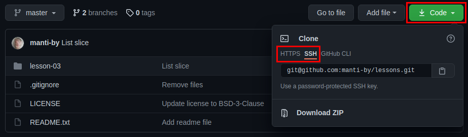

Z56 lessons repository
====

Git repository setup
----

1. Create a [GitHub account](https://github.com/signup)

2. Crate on GitHub a repository called "lessons"
   
2. Open bash terminal

3. Install git package to the system

        sudo apt install -y git

4. Setup your user account

         git config --global user.name "Alexander Chaika"
         git config --global user.email "manti.by@gmail.com"

5. Create projects directory and go to it

         mkdir projects
         cd projects/

6. Clone this repository and go to it

         git clone https://github.com/manti-by/lessons.git
         cd lessons/

7. Create an empty file and check git status, new file should be colored in red

         touch README.md
         git status

8. Add a new file to repository and check status, new file should be green 

         git add README.md
         git status

9. Save (commit) a nw file to local repository and then push it to GitHub

         git commit -m "Add readme file"
         git push

FAQ      piton

----

If you crated keys for GitHub and still on push git asks for login/password,
change your repository url from HTTPS to SSH:

      git remote set-url origin git@github.com:manti-by/lessons.git

